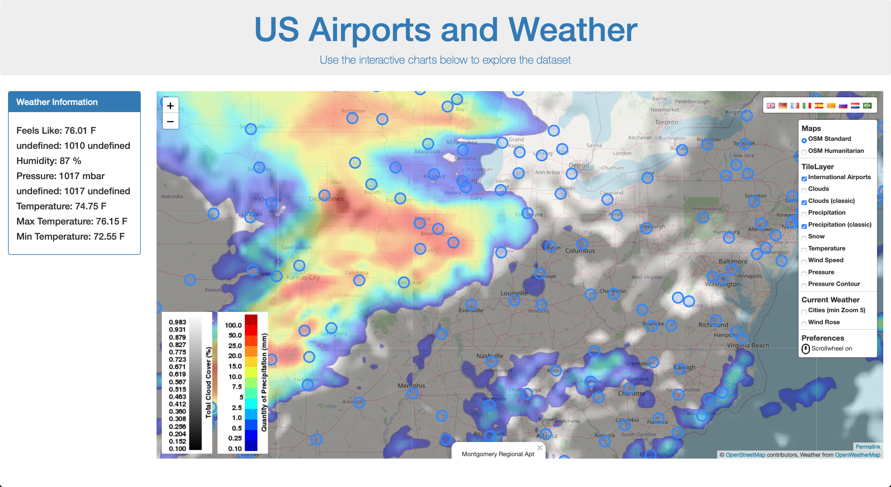
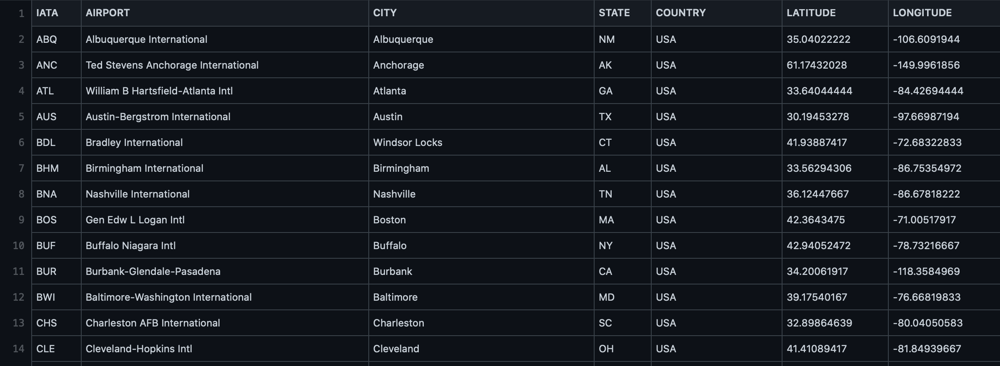
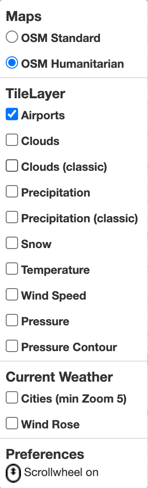
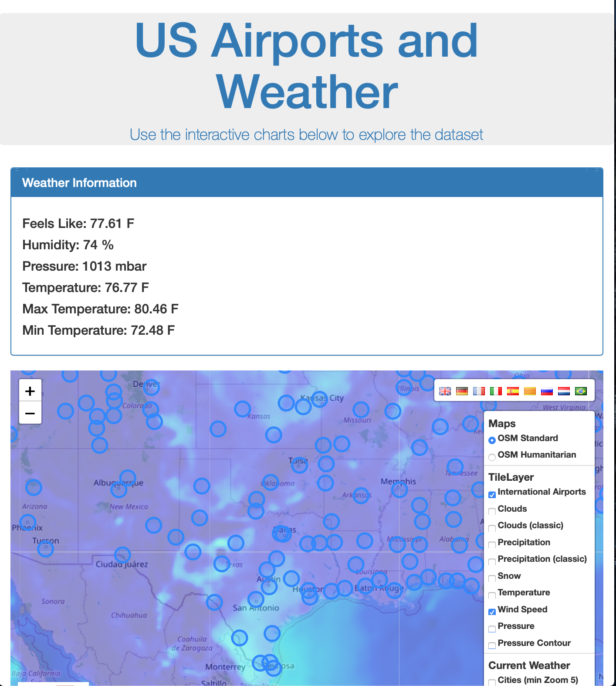

# Project 2: Airport Weather Map

The goal of this project is to build a web data visualization utilizing the following technology:
  - Python-Flask powered
  - HTML and CSS
  - Javascript
  - a database (Postgres, MongoDB, SQLite, etc.)
  - Web-scraping
  - Leaflet and Mapbox
  
### Other requirements:
  - Include a JS library not covered in class. (In our case, jQuery Ajax and Creative Commons Zero)
  - Powered by a dataset with at least 100 records. 
  - User-driven interactions (menus, drop-downs, textboxes, etc.)
  - Final page should include at least 3 visualizations. 

# Our Project

We decided to create a map that allows users to locate US airports, view the weather at their locations by clicking on points on the map, and provide up-to-date map layers of precipitation, wind, temperature, etc. 

1. To start with, we located all the public airports in the US and imported the locations in a CSV: 
https://github.com/MikeT9/Project-2/blob/main/Mike's%20code/static/airports.csv

2. The location info for the csv is loaded into SQLite so that it can be stored and updated for future use. 

3. Using Python-Flask, we hit the OpenWeather API with our various locations in our SQLite table to get the current weather at each airport: 
https://github.com/MikeT9/Project-2/blob/main/Mike's%20code/app.py  
https://api.openweathermap.org/data/2.5/weather

4. Using the locations, we create tile layer of markers on the MapBox API for the airports, and add it to our map using Leaflet:
   https://github.com/MikeT9/Project-2/blob/main/Mike's%20code/static/map.js
   
   
5. Layers are also created for the various weather attributes using a JS Library from Creative Commons Zero, along with a map legend to control the airport and weather layers, the language, and the map scroll feature.  
   Weather attributes include:  
   		` temperature: 'Temperature'`  
			 `temp_minmax: 'Temp. min/max'`  
			` wind: 'Wind'`  
			` gust: 'Gust'`  
			` windforce: 'Wind Force'`  
			 `direction: 'Direction'`  
			` rain_1h: 'Rain'`  
		  ` humidity: 'Humidity' `  
			` pressure: 'Pressure'`  
    
6.  As you click on airports on the map, the application will display the name of the airport in the map pop-up and fetch weather data for that airport. 
  	- In order to make asynchronous server calls to fetch the weather data without stalling the map, we used the jQuery Ajax. 
 	 - The weather data for that airport populates in the panel to the right.
      
            
7. We used BootStrap to set up our screen, using jumbotron features for the page header, a row to include the panel for the weather info and map that will stack on top of each other if opened in a small screen. 
      
